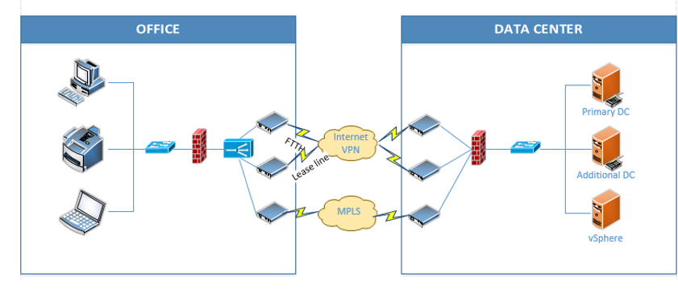
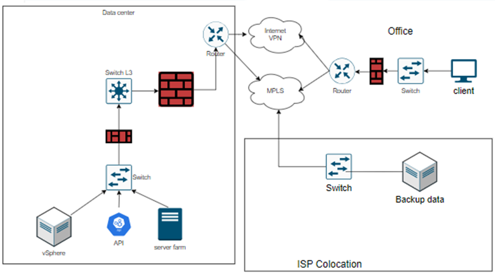

# Banking payment, security architecture, risk management

# Rủi ro mô hình hiện tại

Rủi ro an toàn thông tin của mô hình banking payment hiện tại

1. Thiếu Phần Mềm Antivirus/Firewall Chuyên Dụng.
2. Điểm Đơn Lẻ Hỏng Hóc (Single Point of Failure) - Nếu router tích hợp firewall hoặc thiết bị cân bằng tải hỏng dẫn đến sự cố ngừng trệ toàn bộ mạng.
3. Mô Hình Domain Không Được Quản Lý Chặt Chẽ.
4. Không Có Chính Sách Sao Lưu Và Phục Hồi Dữ Liệu.
5. Không Có Chính Sách Vận Hành - dẫn đến việc thực hành quản lý hệ thống không nhất quán, từ đó tạo ra các lỗ hổng an ninh.
6. Không Có Chính Sách An Ninh Thông Tin - nhân viên có thể không nhận thức được vai trò của mình trong việc duy trì an ninh, dẫn đến các thực hành không an toàn.
7. Trung Tâm Dữ Liệu Tập Trung - Tất cả máy chủ đều đặt tại một trung tâm dữ liệu có thể rủi ro nếu không có địa điểm phục hồi sau thảm họa.
8. Nguy Cơ Tấn Công DDoS.
9. Giám Sát Và Cảnh Báo Không Đủ - có thể có sự chậm trễ hoặc không phản ứng trước các mối đe dọa an ninh đang diễn ra.
10. Phân đoạn mạng không đủ - kẻ xâm nhập có thể dễ dàng lan truyền từ một phần của mạng sang các phần khác.

## Rủi ro liên quan đến mất mát dữ liệu

### Attacker:
- Tấn công social engineering.
- Tấn công giả mạo.
- Tấn công vào các lỗ hổng bảo mật SQL.
- Tấn công vào nhân viên, mua chuộc, dụ dỗ, đe dọa,...
- Tấn công hệ thống bằng malware.
- Tấn công vật lý: đánh cắp tài sản, tài liệu giấy, phá hoại hệ thống điện,...

### Nhân viên:
- Sử dụng thiết bị cá nhân, các phần mềm trao đổi nội dung thông tin, nhắn tin có dữ liệu ra ngoài.
- Nhân viên cài cắm thiết bị lạ, software lạ.
- Làm mất thiết bị.
- Nhân viên truy cập dữ liệu trái phép.
- Chưa có chính sách chống social engineering

## Giải pháp

