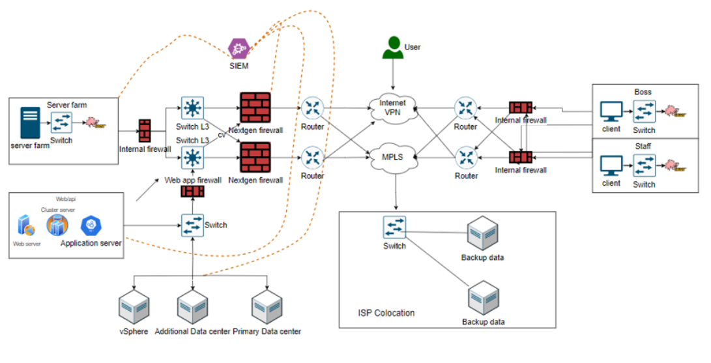

# Banking payment, security architecture, risk management

# Rủi ro mô hình hiện tại

Rủi ro an toàn thông tin của mô hình banking payment hiện tại

1. Thiếu Phần Mềm Antivirus/Firewall Chuyên Dụng.
2. Điểm Đơn Lẻ Hỏng Hóc (Single Point of Failure) - Nếu router tích hợp firewall hoặc thiết bị cân bằng tải hỏng dẫn đến sự cố ngừng trệ toàn bộ mạng.
3. Mô Hình Domain Không Được Quản Lý Chặt Chẽ.
4. Không Có Chính Sách Sao Lưu Và Phục Hồi Dữ Liệu.
5. Không Có Chính Sách Vận Hành - dẫn đến việc thực hành quản lý hệ thống không nhất quán, từ đó tạo ra các lỗ hổng an ninh.
6. Không Có Chính Sách An Ninh Thông Tin - nhân viên có thể không nhận thức được vai trò của mình trong việc duy trì an ninh, dẫn đến các thực hành không an toàn.
7. Trung Tâm Dữ Liệu Tập Trung - Tất cả máy chủ đều đặt tại một trung tâm dữ liệu có thể rủi ro nếu không có địa điểm phục hồi sau thảm họa.
8. Nguy Cơ Tấn Công DDoS.
9. Giám Sát Và Cảnh Báo Không Đủ - có thể có sự chậm trễ hoặc không phản ứng trước các mối đe dọa an ninh đang diễn ra.
10. Phân đoạn mạng không đủ - kẻ xâm nhập có thể dễ dàng lan truyền từ một phần của mạng sang các phần khác.

## Rủi ro liên quan đến mất mát dữ liệu

### Attacker:
- Tấn công social engineering.
- Tấn công giả mạo.
- Tấn công vào các lỗ hổng bảo mật SQL.
- Tấn công vào nhân viên, mua chuộc, dụ dỗ, đe dọa,...
- Tấn công hệ thống bằng malware.
- Tấn công vật lý: đánh cắp tài sản, tài liệu giấy, phá hoại hệ thống điện,...

### Nhân viên:
- Sử dụng thiết bị cá nhân, các phần mềm trao đổi nội dung thông tin, nhắn tin có dữ liệu ra ngoài.
- Nhân viên cài cắm thiết bị lạ, software lạ.
- Làm mất thiết bị.
- Nhân viên truy cập dữ liệu trái phép.
- Chưa có chính sách chống social engineering

## Giải pháp

### Mô hình tổng thể

### Mô hình chi tiết

### Traffic flow

## XÂY DỰNG CHÍNH SÁCH

* IDS: Đặt 1 IDPS trước các public gateway để filter các traffic public đi từ bên ngoài vào mạng nội bộ, đồng thời giảm tải traffic cho router gateway. 

* Firewall: Đặt firewall phía sau router để giám sát các traffic mạng đi đến mạng nội bộ. Dùng NGFW để filter cũng như phát hiện các cuộc tấn công dựa vào các signature base. Ngoài ra, NGFW còn có khả năng đọc vào payload của các gói tin, dựa vào đó chúng ta có thể ngăn chặn các cuộc tấn công liên quan đến tầng application.

### Chính sách cho Firewall

- 1: Tất cả các giao dịch không được ủy quyền đều sẽ bị chặn.
- 2: Tất cả các cổng không cần thiết sẽ bị đóng.
- 3: Địa chỉ IP nằm ngoài danh sách trắng sẽ bị chặn.
- 4: Thời gian không hoạt động tối đa được cho phép là 15 phút.
- 5: Các phiên bản phần mềm của firewall phải được cập nhật định kỳ.
- 6: Được yêu cầu xác thực hai yếu tố để truy cập vào hệ thống quản lý firewall.
- 7: Không cho phép quyền truy cập SSH từ internet công cộng.
- 8: Ghi lại và lưu trữ tất cả các sự kiện truy cập.
- 9: Tỉ lệ gói tin bị từ chối trên tổng số gói tin phải được giám sát.
- 10: Đánh giá và kiểm tra cấu hình firewall ít nhất mỗi quý.

### Chính sách cho IDS/IPS (Hệ thống phát hiện và ngăn chặn xâm nhập):

- 1: Cập nhật định kỳ các chữ ký và định nghĩa để phát hiện các mối đe dọa mới.
- 2: Ghi lại và lưu trữ tất cả các cảnh báo và sự kiện.
- 3: Tự động chặn các nguồn tấn công sau khi phát hiện.
- 4: Thiết lập cảnh báo trong trường hợp có dấu hiệu xâm nhập nghiêm trọng.
- 5: Kiểm tra tính hiệu quả của IDS/IPS thông qua các bài kiểm tra xâm nhập giả định.
- 6: Không cho phép truy cập IDS/IPS từ internet công cộng.
- 7: Khuyến khích sử dụng mã hóa cho dữ liệu truyền giữa các thành phần của IDS/IPS.
- 8: Ngăn chặn việc truyền thông tin nhạy cảm nếu IDS/IPS phát hiện.
- 9: Kiểm tra và xác minh nguồn gốc của các cảnh báo.
- 10: Tham gia vào các cộng đồng an ninh để cập nhật thông tin về các mối đe dọa mới.

### Chính sách cho kết nối internet và antivirus

- 1: Tất cả các máy tính trong mạng nội bộ không được phép truy cập internet trực tiếp mà phải thông qua proxy hoặc gateway an ninh.
- 2: Antivirus phải được cài đặt trên tất cả các máy tính và máy chủ.
- 3: Cập nhật định kỳ cơ sở dữ liệu virus.
- 4: Quét toàn bộ hệ thống ít nhất mỗi tuần một lần.
- 5: Khóa tự động các tệp tin hoặc phần mềm nếu được phát hiện là độc hại.
- 6: Ngăn chặn việc sử dụng ổ USB hoặc thiết bị lưu trữ ngoại vi nếu không được ủy quyền.
- 7: Khuyến khích nhân viên không tải và cài đặt phần mềm không được xác thực.
- 8: Cảnh báo người dùng nếu truy cập vào trang web độc hại hoặc không được tin cậy.
- 9: Ghi lại và lưu trữ tất cả các sự kiện liên quan đến virus hoặc phần mềm độc hại.
- 10: Đào tạo và nâng cao nhận thức cho nhân viên về các mối đe dọa và cách phòng tránh.

### Chính sách end user

1.Người dùng cuối phải tuân thủ các quy định về sử dụng hệ thống và dữ liệu.
2.Cần phải tuân theo hướng dẫn an toàn mật khẩu và thực hiện đổi mật khẩu định kỳ.
3.Không chia sẻ thông tin đăng nhập với người khác và luôn khóa máy khi rời khỏi.
4.Cảnh giác với các email và liên kết đáng ngờ, không mở tệp đính kèm không rõ nguồn gốc.
5.Báo cáo ngay lập tức cho bộ phận IT nếu nghi ngờ có hành vi gian lận hoặc xâm nhập.
6.Người dùng cuối phải thực hiện các biện pháp bảo vệ thông tin cá nhân và thông tin doanh nghiệp, không được phép chia sẻ trực tiếp trên các nền tảng trực tuyến không được phép.
7.Mọi việc cài đặt phần mềm hoặc thay đổi cấu hình hệ thống phải được sự chấp thuận của bộ phận IT.
8.Sử dụng các dịch vụ lưu trữ đám mây doanh nghiệp được phê duyệt để đồng bộ và chia sẻ tài liệu làm việc.
9.Thực hiện các khóa học an ninh mạng cơ bản được tổ chức định kỳ bởi bộ phận IT.
10.Tuân thủ quy trình xử lý và báo cáo sự cố an ninh mạng, bao gồm việc nhận biết và báo cáo các hành vi đáng ngờ.

### Chính sách backup hạ tầng

1. Thực hiện sao lưu dữ liệu định kỳ và kiểm tra khả năng phục hồi sao lưu.
2. Dữ liệu cần được sao lưu tại ít nhất hai địa điểm lưu trữ độc lập.
3. Sao lưu dữ liệu cần được mã hóa để đảm bảo an toàn trong quá trình truyền tải và lưu trữ.
4. Xác định rõ ràng trách nhiệm và quy trình khi có sự cố mất mát dữ liệu.
5. Đào tạo nhân viên về tầm quan trọng của việc sao lưu dữ liệu và cách thức thực hiện.
6. Phân quyền truy cập dữ liệu sao lưu chỉ cho nhân viên có thẩm quyền và theo dõi lịch sử truy cập.
7. Kiểm tra định kỳ chất lượng dữ liệu sao lưu để đảm bảo dữ liệu không bị hỏng hoặc thay đổi.
8. Lưu trữ bản sao lưu dữ liệu tại một địa điểm lý tưởng ngoài trực tuyến để phòng tránh rủi ro mất mát dữ liệu do tấn công mạng.
9. Thiết lập quy trình sao lưu tự động và giám sát để giảm thiểu sai sót do yếu tố con người.
10. Thực hiện sao lưu dựa trên cấp độ quan trọng của dữ liệu, sao lưu dữ liệu quan trọng nhiều lần hơn.

